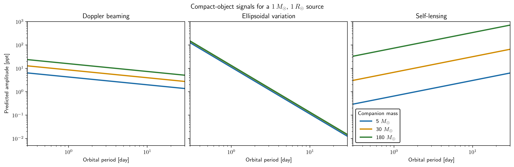

# troia

## Introduction
Troia is a pipeline to search for and characterize compact objects with stellar companions.

## Status

The maintained scientific API is the package under `troia/`, especially the main workflow and the normalized path helpers in `troia/paths.py`.

The collaborator-specific analysis files under `troia/kartik_eli/` are legacy prototype material and are not part of the active API contract. They are retained only for provenance and historical comparison, and they should be treated as archived exploratory scripts unless a specific analysis is being actively migrated into the supported package.

## Supported workflow

- Active package entry points and workflow logic live in the main package modules.
- Reusable path behavior is centralized in `troia/paths.py`.
- Data products and diagnostics should be written under the configured environment-based data tree rather than collaborator-specific notebook or workstation paths.

## Installation

```bash
python -m pip install -e .
export TROIA_PATH=/path/to/troia
```

`TROIA_PATH` identifies the repository root. Keep runtime inputs in `data/` and generated pipeline outputs in `visuals/`; both directories are ignored by Git. The existing `retr_pathgaia()` helper retains its workflow-specific behavior.

## Example

The runnable example evaluates Troia's maintained photometric-signature calculation over orbital periods from 0.3 to 30 days:

```bash
python examples/compact_object_signatures.py --typefileplot png
```



The deterministic calculation compares Doppler beaming, ellipsoidal variation, and self-lensing for 5, 30, and 180 solar-mass companions. It assumes a 1-solar-mass, 1-solar-radius source with a mean density of 1.41 grams per cubic centimeter. These are model predictions rather than observed light curves.

## Archive note

Files such as `2bholtest.py` and `tic_oneline.py` are retained as historical scripts; they are not part of the supported troia scientific workflow and should not be imported by downstream code unless the user is explicitly working on the legacy prototype.

