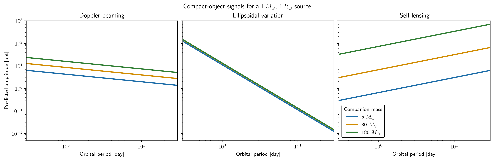

# troia

## Introduction
Troia is a pipeline to search for and characterize compact objects with stellar companions.

Data products and diagnostics are written under the configured environment-based data tree. Reusable path handling is available in `troia/paths.py`.

## Installation

```bash
python -m pip install -e .
export TROIA_PATH=/path/to/troia
```

`TROIA_PATH` identifies the repository root. Keep runtime inputs in `data/` and generated pipeline outputs in `visuals/`; both directories are ignored by Git. The existing `retr_pathgaia()` helper retains its workflow-specific behavior.

## Example

The runnable example evaluates Troia's maintained photometric-signature calculation over orbital periods from 0.3 to 30 days:

```bash
python examples/compact_object_signatures.py --typefileplot png
```



The deterministic calculation compares Doppler beaming, ellipsoidal variation, and self-lensing for 5, 30, and 180 solar-mass companions. It assumes a 1-solar-mass, 1-solar-radius source with a mean density of 1.41 grams per cubic centimeter. These are model predictions rather than observed light curves.

